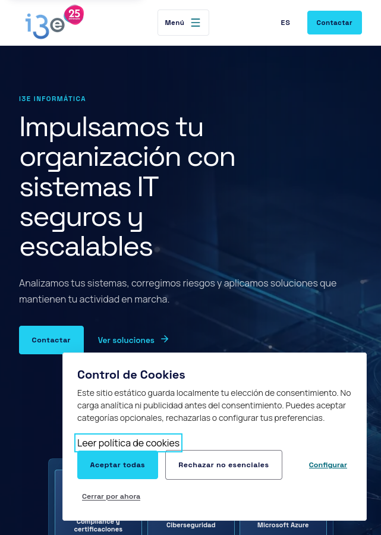
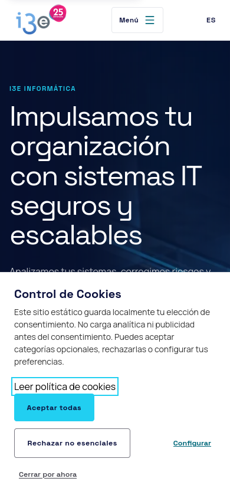
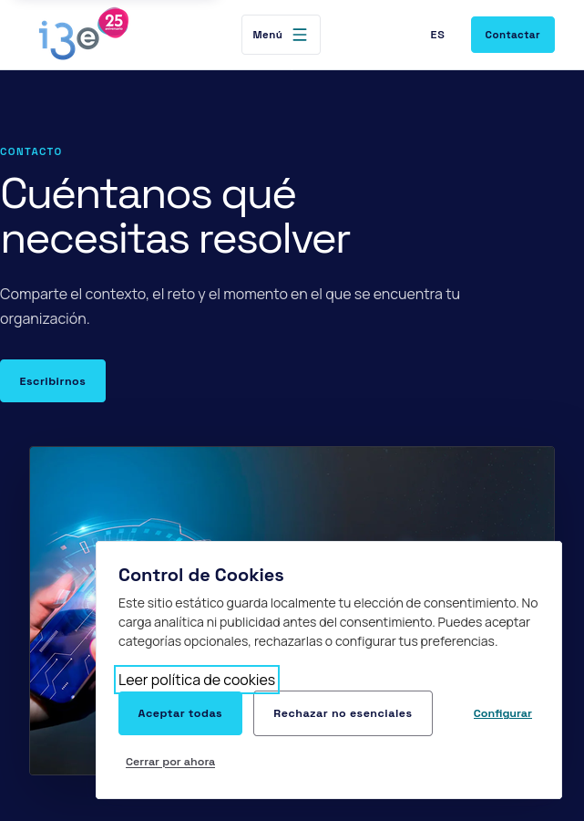
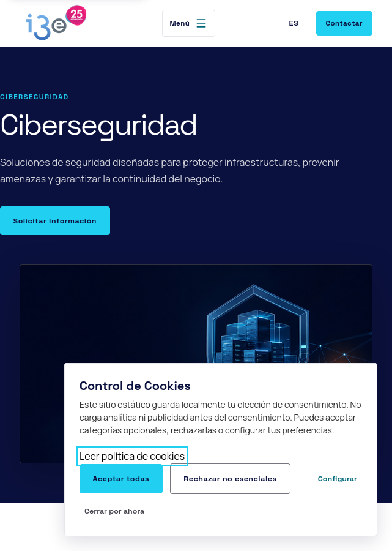

# i3e Informática


---

Web corporativa estática de **i3e Informática**, empresa de consultoría tecnológica especializada en ciberseguridad, Microsoft 365, Azure e infraestructuras IT.



## Características principales

- **Contenido dinámico**: Páginas generadas desde JSON localizable
- **Multiidioma**: Soporte para ES, CA, EU, GL, PT, EN, FR, DE
- **Diseño responsive**: Optimizado para móvil, tablet y escritorio
- **Accesibilidad**: Cumplimiento WCAG AA
- **Rendimiento**: Exportación estática para GitHub Pages
- **Testing**: Suite de tests unitarios con Vitest

## Capturas de pantalla

| Escritorio | Móvil |
|------------|-------|
|  |  |

| Página | Descripción |
|--------|-------------|
|  | Formulario de contacto y ubicaciones |
|  | Servicios de seguridad informática |
|  | Soluciones y productos M365 |
|  | Equipo y valores de la empresa |

## Requisitos

- **Node.js** 22 o superior
- **pnpm** 10 o superior

## Inicio rápido

```bash
# Clonar el repositorio
git clone https://github.com/BeatrizAgent/i3einformatica.git
cd i3einformatica

# Instalar dependencias
pnpm install

# Iniciar servidor de desarrollo
pnpm dev
```

El sitio estará disponible en `http://localhost:3000`.

## Comandos disponibles

| Comando | Descripción |
|---------|-------------|
| `pnpm dev` | Servidor de desarrollo |
| `pnpm build` | Build de producción → `out/` |
| `pnpm lint` | Verificación ESLint |
| `pnpm typecheck` | Verificación TypeScript |
| `pnpm test` | Tests unitarios con Vitest |
| `pnpm check` | lint + typecheck + test + build |
| `pnpm content:validate` | Validar contenido JSON |
| `pnpm encoding:check` | Verificar codificación |
| `pnpm export:validate` | Validar exportación estática |
| `pnpm assets:sync` | Sincronizar assets remotos |

## Estructura del proyecto

```
i3einformatica/
├── src/
│   ├── app/                    # Rutas Next.js (App Router)
│   │   ├── [[...segments]]/    # Ruta catch-all para i18n
│   │   ├── globals.css         # Estilos globales y tokens
│   │   └── layout.tsx          # Layout raíz
│   ├── components/             # Componentes React
│   │   ├── landing/            # Componentes de landing pages
│   │   ├── site-shell.tsx      # Header y footer
│   │   └── public-page.tsx     # Composición de páginas públicas
│   └── lib/                    # Utilidades
│       ├── content/            # Helpers de contenido JSON
│       ├── site-assets.ts      # Gestión de assets
│       └── public-path.ts      # Rutas públicas
├── data/
│   └── content/
│       ├── pages/              # Contenido editorial (16 páginas)
│       └── assets.json         # Catálogo de assets
├── public/
│   └── assets/i3e/             # Assets estáticos optimizados
├── scripts/                    # CLI de auditoría y validación
├── docs/                       # Documentación
│   ├── screenshots/            # Capturas del sitio
│   └── migration/              # Documentación de migración
└── out/                        # Build de producción (gitignore)
```

## Contenido editorial

El contenido de las páginas se gestiona mediante archivos JSON en `data/content/pages/`. Cada archivo contiene:

- **`family`** y **`templateVariant`**: Composición visual
- **`locales.es`** y **`locales.en`**: Contenido localizado
- **`assetId`**: Referencia a assets (no rutas directas)
- **`editorialStatus`**: Estado del contenido (`in_review`, `approved`, `published`)

Para validar cambios en el contenido:

```bash
pnpm content:validate
```

## Despliegue

### GitHub Pages

El workflow `.github/workflows/deploy-pages.yml` publica automáticamente el build estático en GitHub Pages.

**Configuración para repo de proyecto:**

```yaml
NEXT_PUBLIC_BASE_PATH: /i3einformatica
```

**Dominio propio:**

1. Deja `NEXT_PUBLIC_BASE_PATH` vacío
2. Añade un archivo `public/CNAME` con tu dominio
3. Configura los registros DNS para apuntar a GitHub Pages

### Build local

```bash
pnpm build
# El resultado queda en out/
```

## Formularios

Los formularios de contacto y empleo abren el cliente de correo del usuario, ya que GitHub Pages no ejecuta backend.

El canal de denuncias no recoge contenido ni promete anonimato: muestra una alternativa postal hasta disponer de infraestructura segura.

## Roadmap

### Fase 1 — Completada

- [x] Migración desde WordPress a Next.js
- [x] Contenido JSON localizable
- [x] Diseño responsive Swiss Tech B2B
- [x] Despliegue en GitHub Pages
- [x] Multiidioma (ES/EN)

### Fase 2 — En progreso

- [ ] Optimización de rendimiento y SEO
- [ ] Tests E2E con Playwright
- [ ] Formularios con backend (Contacto, Empleo)
- [ ] Panel de administración de contenido

### Fase 3 — Futuro

- [ ] CMS headless para gestión de contenido
- [ ] Blog técnico
- [ ] Área de clientes
- [ ] Integración con CRM
- [ ] Soporte para más idiomas (CA, EU, GL, PT, FR, DE)

## Tecnologías

| Categoría | Tecnología |
|-----------|------------|
| Framework | Next.js 16 |
| UI | React 19 |
| Lenguaje | TypeScript 5 |
| Estilos | Tailwind CSS 4 |
| Animaciones | GSAP, Motion |
| Testing | Vitest 4 |
| Iconos | Iconify |
| Despliegue | GitHub Pages |

## Contribuir

Consulta [CONTRIBUTING.md](CONTRIBUTING.md) para guías detalladas de contribución.

## Licencia

Este proyecto está licenciado bajo la [Licencia Apache 2.0](LICENSE).

---

**i3e Informática** — Consultoría, ciberseguridad, cloud e infraestructuras para empresas.
